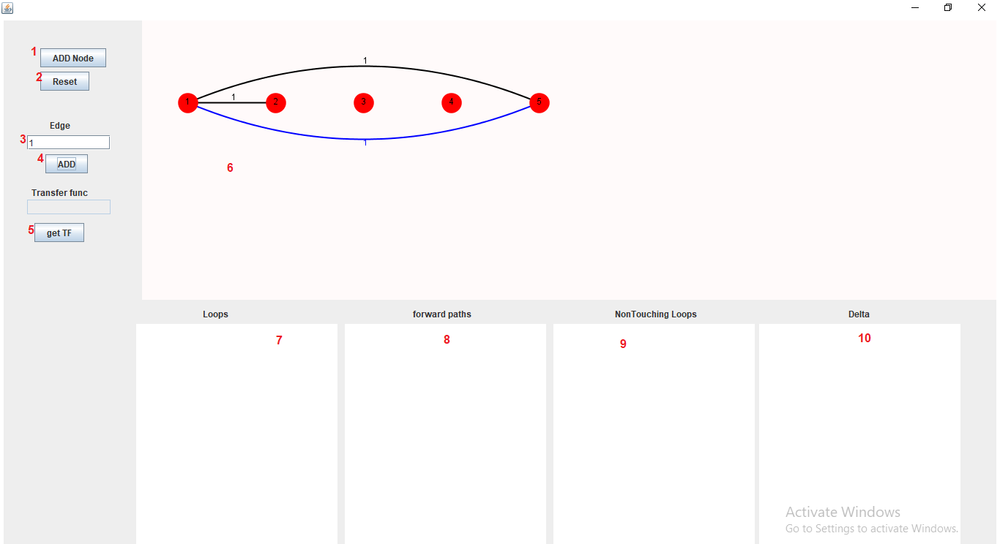
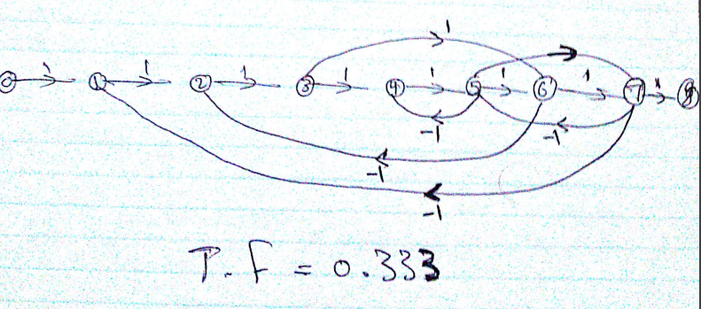
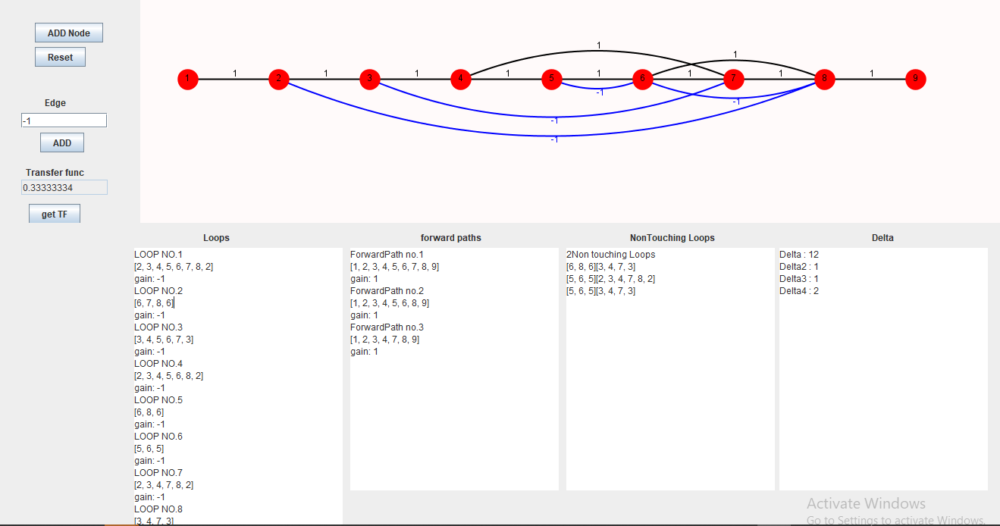

# signal-flow-graph
Application to calculate the overall transfer function given its signal flow graph which can be drawn easily using a friendly graphical user interface.

## Code design :
  - Data structers :
    - Path data structure :
      - This is generated data structure to store all necessary paths such as forward paths and loops with gains and their nodes.
    - ArrayList :
      - To store all objects associated with graph,forward paths and loops.
    - HashMap:
      - Used to store non_touching loops for any combination where its key represent number of non_touching loops and its value represets the loops.
  - Algorithms :
    - DFS Algorithm :
      - To find loops and forward paths.
    - backtracking :
      - To find forward paths.
      
## User guide :

  1. add new node 
  2. reset the drawing board
  3. write gain for an new edge
  4. add new edge by pressing on the two nodes
  5. solve the problem and get overall transfer function
  6. drawing board 
  7.8.9.10. display the result of the problem

## Example :
  - Problem :
     
  - Solution :
     
 
